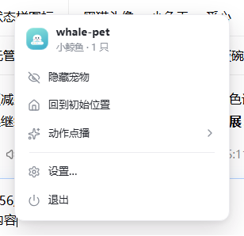
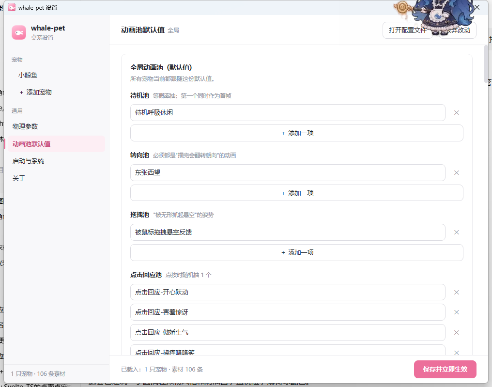
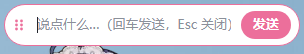

# whale-pet desktop

**把 [whale-pet](https://github.com/PC2005-cloud/whale-pet) 的桌宠做成一个独立的 Windows 桌面应用**（Tauri v2）：
不依赖 DSH、不依赖浏览器，装完即用——透明置顶小窗 + 手绘透明动画 + 拖拽甩抛 + 点击 Q 弹 + 点击穿透。

- 🐳 **手绘透明动画的完整行为链**：106 条 VP9-alpha `.webm`，待机 / 转向 / 屏幕漫游 / 按权重的随机动作分类，播完立即衔接
- 🖱️ **原生桌面手感**：跟手弹簧拖拽、甩抛物理、逐屏工作区边界、落地静止、点击 Q 弹、整窗点击穿透（不挡下层窗口）
- 🧭 **像个正经应用**：托盘完整菜单、设置窗口（保存即生效）、单实例锁、开机自启、配置热重载、自绘浅/深色界面
- 🤖 **可选 AI，默认全关零联网**：碎碎念、对话输入窗、表情包配图、余额 / 用量查询（DeepSeek、OpenCode、OpenAI 兼容、Ollama、自定义）
- 📦 **离线可用**：安装包自带全部素材（约 60 MB），装完直接就有 106 条动画，不需要联网也不需要跑导入脚本

| 托盘菜单 | 设置窗口 · 动画池 | 对话输入窗 |
| --- | --- | --- |
|  |  |  |

> 图都是**真实运行的窗口截图**（由 `scripts/capture-window.ps1` 走屏幕合成抓取，不是设计稿）；
> 全部截图与说明见 [`docs/screenshots/`](docs/screenshots/README.md)。
> 截图里宠物浮在设置窗之上是**预期行为**（宠物窗是 `always_on_top`）。

---

## 目录

- [一、这是什么](#一这是什么)
- [二、功能一览](#二功能一览)
- [三、安装与使用](#三安装与使用)
  - [3.1 安装](#31-安装) · [3.2 怎么玩](#32-怎么玩) · [3.3 数据目录与配置](#33-数据目录与配置)
- [四、当前状态](#四当前状态)
- [五、文档索引](#五文档索引)
- [六、许可](#六许可)

> **想改这个项目**（环境、构建、出包、目录结构、设计要点、"为什么这么做"）：
> 看 [`docs/DEVELOPMENT.md`](docs/DEVELOPMENT.md)。

---

## 一、这是什么

一个**独立的桌宠应用**：一只（或多只）半透明动画角色待在桌面上，会呼吸、会转头、会自己走动、
会被你拖着甩出去、会在落地时弹一下、点击它会有反应，右键能点播动作，托盘能显隐与设置。

设计取舍是"**纯粹的桌宠**"，而不是又一个常驻面板：

| 取舍 | 选择 |
| --- | --- |
| 联网 | **默认零联网**。AI 能力全部默认关闭，开启后才用你自己的 Key 调 LLM |
| 依赖 | 不依赖 DSH、不需要浏览器扩展。Tauri v2 + 系统自带 WebView2 |
| 素材归属 | 应用数据目录是唯一真相：随包素材只**补缺失**地释放，你自己放/删的动画不会被覆盖或复生 |
| 配置 | 一个带注释的 `config.jsonc`，改完 1 秒内热重载；不合法就大声报错，绝不静默兜底 |

**与上游的关系**：本仓库**只读取**上游 [`whale-pet`](https://github.com/PC2005-cloud/whale-pet)，
从不修改它。上游桌宠的纯逻辑层（物理弹簧、动画链抽签、移动几何、级联菜单的树与样式）
以**逐字节零改动**的方式拷贝进 `reference/shared/`，所以手感与菜单行为与上游同源；
拷了什么、为什么、怎么同步，见 [`docs/COPY-MANIFEST.md`](docs/COPY-MANIFEST.md)。
需要适配的地方一律在本仓库这层包一层（例如弹簧系数只在 `src/renderer/drag.ts` 里偏离）。

**技术栈**：Tauri v2（Rust）+ WebView2（Chromium）+ 原生 TypeScript / Vite，**前端不用框架、不引 UI 库**；
界面图标是 [Lucide](https://lucide.dev) 的形状内联，应用图标由 `cargo run --example make-icon`
从 `src-tauri/icons/design/` 的图形源栅格化成 exe / 托盘 / 页头三份。

---

## 二、功能一览

### 宠物行为

| 能力 | 说明 |
| --- | --- |
| 完整动画链 | 待机 / 转向（播完翻转朝向）/ 屏幕漫游 / 随机动作分类（各分类带权重、可"避免连续重复"）；文字类动作 `noMirror`，朝右时强制朝左 |
| 拖拽与抛掷 | 跟手弹簧（临界阻尼、带一点重量）、松手按真实初速甩出、逐屏工作区并集为边界、落地静止在工作区底边 |
| 点击回应 | 单击播点击回应动画 + Q 弹挤压；拖拽期间输入 busy 保护（绝不半途断掉） |
| 多宠物 | `pets` 数组每项 = 一个独立透明置顶窗口；每只可**单独覆盖**动画池与权重 |
| 素材 | 106 条动画 + 27 张表情包 + 气泡字体；`scripts\import-animations.ps1` 从上游导入，也可自己往数据目录丢 `.webm` |

### 交互与界面

| 能力 | 说明 |
| --- | --- |
| 右键级联菜单 | 动作（分类 → 具体动画）/ 工具（显示气泡、回到初始位置、说两句、查余额）。**独立小窗**，宠物窗全程不改几何 |
| 自绘托盘菜单 | 显示/隐藏（一个切换项）、回到初始位置、动作点播（分类默认收起、点了才展开，多宠时顶部有宠物切换）、设置、退出 |
| 设置窗口 | 独立普通窗口：宠物增删、名称/ID/尺寸/角落/边距、物理参数、动画池与权重、启动与系统、AI；**保存即生效** |
| 对话输入窗 | 宠物右上角的单行输入条（回车发送、Esc 关闭，回复走气泡）；本项目唯一的**可聚焦**辅助窗 |
| 主题 | 跟随系统浅/深色 |

### 应用能力

单实例锁（重复启动只把已有窗口顶出来）· 开机自启（写 HKCU Run，与设置窗口共用）·
配置热重载（1 秒指纹轮询，改坏了保留当前配置并在日志说明原因）· 诊断日志（`pet-debug.log`）·
诊断探针与截图脚本 · CSP 收紧的生产构建。

### AI（默认全关）

碎碎念（按周期生成一句 → 气泡显示）· 对话（`memory.json` 全量记忆，最近 N 轮进上下文）·
表情包配图（碎碎念随机抽 / 对话按语境选，标记只在池内命中才采纳）· 余额与用量（DeepSeek `/user/balance`、
OpenCode `/zen/go/v1/usage`，六档余额动画）。Key 用 **DPAPI** 加密存在本机，请求在 **Rust 侧**发出
（页面 CSP 因此不需要放行任何外部域名）。设计见 [`docs/LLM.md`](docs/LLM.md)。

---

## 三、安装与使用

### 3.1 安装

| 产物 | 大小 | 说明 |
| --- | --- | --- |
| `whale-pet_1.0.0_x64-setup.exe` | 约 62 MB | NSIS 安装器，**推荐**（中文安装界面，Unicode） |
| `whale-pet_1.0.0_x64_zh-CN.msi` | 约 64 MB | MSI（代码页 936，中文素材文件名必需） |

- 安装包**未做代码签名**，Windows 会提示「未知发布者」，选择继续即可；
- 运行环境：Windows + WebView2 运行时（Win10/11 一般系统自带）。GNU 工具链下 exe 还依赖
  `WebView2Loader.dll`——按 [开发文档的出包命令](docs/DEVELOPMENT.md#三出包生成完整安装包) 出包时
  它会被一起打进安装器（**本机只核到"NSIS 体积 +0.1 MB、与该 DLL 相符"，装一次确认仍在待办里**）；
- 首次启动会把**随包素材只补缺失地**释放到数据目录，所以装完就有 106 条动画。

> 自己从头构建安装包：见 [`docs/DEVELOPMENT.md`](docs/DEVELOPMENT.md) 的「出包」一节
> （三条命令 + 四个已经踩过的坑）。

### 3.2 怎么玩

| 想干什么 | 怎么做 |
| --- | --- |
| 点播动作 | **右键宠物** → 「动作」→ 分类 → 具体动画 |
| 让它回角落 | 右键 → 「工具 → 回到初始位置」，或托盘菜单 → 「回到初始位置」 |
| 拖 / 甩 | 按住拖动（跟手弹簧），快速甩手就飞出去，落地会弹 |
| 打它一下 | 单击宠物（播点击回应动画 + Q 弹） |
| 显示 / 隐藏 | 托盘图标**左键**，或托盘菜单第一项（一个切换项） |
| 打开设置 | 托盘菜单 → 「设置」（可增删宠物、改尺寸/角落/物理/动画池） |
| 和它说话 | 右键 → 「工具 → 说两句…」（需要先在设置里开 AI 并填 Key） |
| 退出 | 托盘菜单 → 「退出」 |

### 3.3 数据目录与配置

配置与素材都在 `%APPDATA%\com.whalepet.desktop\`（WebView2 的用户数据目录在 `%LOCALAPPDATA%\com.whalepet.desktop\`）：

| 文件 / 目录 | 说明 |
| --- | --- |
| `config.jsonc` | 主配置（支持 `//` 与 `/* */` 注释）。首次运行自动生成，**绝不覆盖你的改动** |
| `config.jsonc.bak` | 从设置窗口保存时自动备份的上一版（只留最近一次） |
| `webm/` `memes/` `pic/` `fonts/` | 动画 / 表情包 / 图标 / 气泡字体。放自己的 `.webm`（VP9-alpha）即可在配置里引用 |
| `memory.json` | 对话记忆（开了 AI 才有） |
| `llm-key.bin` | API Key（DPAPI 加密，仅本机本用户可解） |
| `pet-debug.log` | 诊断日志 |

几条要点：

- 完整模板与逐字段注释见 [`config/default-config.jsonc`](config/default-config.jsonc)；
- 任何字段缺失或非法都会**明确报错**（打印文件完整路径），不做静默兜底；
- **改完不用重启**：应用每 1 秒比对文件指纹，变了就热重载（拆旧窗、按新配置重建）；
- 每只宠物可写 `animations` / `animationWeights` **整体覆盖**全局默认（不写则跟随全局）；
- 从设置窗口保存会**整体重写**配置文件（JSON 不存注释），文件开头会写明这一点——
  想保留手写注释就别从界面保存。

---

## 四、当前状态

**版本 v1.0.0**（仅 Windows x64）。里程碑：M0 技术验证 ✅ / M1 宠物本体 ✅ / M2 像个正经应用 ✅ /
M2.5 外观与结构 ✅ / M3 加分能力（LLM）✅ 基本完成；M4 发布：本机已能产出 NSIS + MSI，
签名与自动更新未做。

- 纯逻辑冒烟 **114 项断言全通过**（`cargo run --bin logic-smoke`）；
- 已知限制里对使用者最要紧的两条：**安装包未签名**（会提示「未知发布者」）、
  **右键菜单在生产构建里的观感待回归**（根因已定位并修复，见 [验证记录第 18 节](docs/VERIFICATION.md)）；
- 完整的状态、逐项限制与"未验证项"清单见 [`docs/DEVELOPMENT.md`](docs/DEVELOPMENT.md#九当前状态与已知限制)，
  路线图见 [`docs/ROADMAP.md`](docs/ROADMAP.md)。

> 这个项目的规矩是：**"完成了"必须有可复现的证据**——要么是日志/探针输出，要么是截图，
> 要么是逐像素比对。做不到的项一律写进上面那份清单，而不是含糊过去。

---

## 五、文档索引

| 文档 | 内容 |
| --- | --- |
| [`docs/DEVELOPMENT.md`](docs/DEVELOPMENT.md) | **开发文档**：环境、跑起来、出包（含四个坑）、冒烟、诊断探针、配置、目录结构、设计要点、状态与已知限制 |
| [`docs/COPY-MANIFEST.md`](docs/COPY-MANIFEST.md) | 与上游的关系：拷了哪些文件、为什么、基线与同步方式、哪些是"借鉴而非拷贝" |
| [`docs/VERIFICATION.md`](docs/VERIFICATION.md) | **验证记录**：每个里程碑的实跑证据、踩过的坑与复盘、明确写出的"未验证项" |
| [`docs/ROADMAP.md`](docs/ROADMAP.md) | 里程碑与待办、待决的产品问题 |
| [`docs/TAURI-CONFIG.md`](docs/TAURI-CONFIG.md) | `tauri.conf.json` 逐字段说明与 CSP 的每条理由 |
| [`docs/LLM.md`](docs/LLM.md) | AI 能力设计：provider 表、密钥存储、请求形状、记忆结构、交互形态 |
| [`docs/screenshots/`](docs/screenshots/README.md) | 全部界面截图与抓取方法 |

---

## 六、许可

- 代码：MIT（与上游一致）
- 素材（动画/提示词/源视频）：**允许开源使用，禁止商用**（上游约定，本应用沿用）
- 界面图标形状：[Lucide](https://lucide.dev)（ISC 许可），已内联进 `src/tray-menu-page.ts` 与
  `src/settings-page.ts`
- 应用图标：**用户提供的素材**（原子轨道图标，`src-tauri/icons/design/`；
  由 `cargo run --example make-icon` 栅格化）——来源与许可由项目所有者确认，仓库里只留了两套样式的原图

> 本仓库**只读取**上游 [`PC2005-cloud/whale-pet`](https://github.com/PC2005-cloud/whale-pet)，从不修改它。
